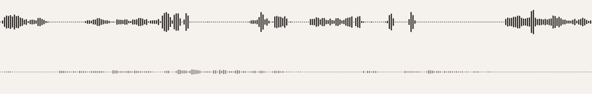

# Open Yap 1K

**Channel-separated English natural two-speaker conversations**

The Agentic Data Company advances conversational AI with Open Yap 1K, the largest free collection of natural conversation ever released: 1,000 hours of two-speaker English speech, open to labs and research teams worldwide.

With this open release, we aim to close a gap in the literature: conversation recorded as it happens in real life. Fisher and Switchboard assigned partners and topics to maximize variety, but the phone network capped their audio near 4 kHz. Newer corpora record at full bandwidth but still pair strangers. Open Yap 1K assigns nothing: each speaker invites someone they already know and talks freely among friends and family.

That choice shows in the speech. People who know each other interrupt more, backchannel more, and leave shorter gaps between turns: the behaviour a full-duplex model has to learn. We compute these dynamics for every conversation (overlap, turn-taking gaps, speaking rate).

These 1,000 hours are one part of a larger licensed corpus we build with frontier labs and research teams. We release them because progress in conversational AI is slower than it needs to be, and open data is the fastest way to change that for everyone.

## At a glance

| | |
|---|--:|
| Hours of audio | 1,000 |
| Conversations | 1,602 |
| Unique speakers | 239 |
| Average duration | 37.5 min |
| Sample rate | 48,000 Hz |
| Channels | one file per speaker |
| Transcripts | word-level, with timings |

## What is in this repository

No audio. This repository holds the documentation, the field schema, the
corpus statistics and the tooling. The recordings live in two places:

- **A free sample**, on the Hugging Face Hub at [TheAgenticDataCompany/open-yap-1k](https://huggingface.co/datasets/TheAgenticDataCompany/open-yap-1k).
  Licensed CC-BY-4.0 with a rider, and downloadable today. See
  [`LICENSE-SAMPLE.txt`](LICENSE-SAMPLE.txt).
- **The full corpus**, by request. Offered under the Open Yap 1K Data Use Agreement,
  which is a contract you accept when you ask. Read it in
  [`LICENSE-CORPUS.txt`](LICENSE-CORPUS.txt), then request the corpus at
  https://theagenticdatacompany.com/open-yap-1k.

Accepting one does not grant the other.

## Hear it

[](https://theagenticdatacompany.com/open-yap-1k#samples)

Both speakers, on one timeline. The image links to a player on the
release page, because GitHub cannot play audio in a README.

The Hugging Face [dataset viewer](https://huggingface.co/datasets/TheAgenticDataCompany/open-yap-1k) plays every sample row in place.
To fetch the audio:

```bash
pip install -r tools/requirements.txt
python tools/download_sample.py
```

## Comparable datasets

| Dataset | Hours | Year | Band | Access | Source |
|---|--:|--:|---|---|---|
| Fisher English | 1,959 | 2004 | narrowband | paid | [LDC2004S13 + LDC2005S13](https://catalog.ldc.upenn.edu/LDC2004S13) |
| **Open Yap 1K** | **1,000** | 2026 | wideband | free | [this release](https://theagenticdatacompany.com/open-yap-1k) |
| Switchboard-2 | 898 | 1998 | narrowband | paid | [LDC98S75 + LDC99S79 + LDC2002S06](https://catalog.ldc.upenn.edu/LDC98S75) |
| otoSpeech full-duplex | 280 | 2026 | wideband | free | [otoearth/otoSpeech-full-duplex-280h](https://huggingface.co/datasets/otoearth/otoSpeech-full-duplex-280h) |
| Switchboard-1 | 260 | 1993 | narrowband | paid | [LDC97S62](https://catalog.ldc.upenn.edu/LDC97S62) |
| AMI Meeting Corpus | 100 | 2006 | wideband | free | [AMI corpus](https://groups.inf.ed.ac.uk/ami/corpus/) |
| CALLHOME English | 56 | 1996 | narrowband | paid | [LDC97S42](https://catalog.ldc.upenn.edu/LDC97S42) |
| CALLFRIEND English | 52 | 1996 | narrowband | paid | [LDC2019S21 + LDC2020S08](https://catalog.ldc.upenn.edu/LDC2019S21) |

Open Yap 1K is the largest publicly available dataset of natural two-speaker English conversation, licensed for commercial use. For this comparison, non-commercial releases are left out, as well as scripted corpora and corpora assembled by diarizing in-the-wild audio.

- **Fisher English** — 984 hours in Part 1, 975 in Part 2.
- **Switchboard-2** — Phases I and II are stated as conversation counts at five minutes each, giving 303 and 373 hours; Phase III states 222.
- **CALLFRIEND English** — Roughly 26 hours in each of the two dialect editions, non-Southern and Southern.

## Documentation

| File | What it answers |
|---|---|
| [`DATASHEET.md`](DATASHEET.md) | Who made this, how, from whom, and what it should not be used for |
| [`docs/schema.md`](docs/schema.md) | Every field in the delivered archive |
| [`docs/archive-layout.md`](docs/archive-layout.md) | What a delivered archive looks like on disk |
| [`docs/measurement.md`](docs/measurement.md) | How each published figure is measured |
| [`docs/provenance.md`](docs/provenance.md) | Collection, consent and quality assurance |
| [`docs/access.md`](docs/access.md) | How to request the corpus, and what you may do with it |

Machine-readable equivalents are in [`data/`](data/):
`corpus-stats.json`, `fields.json` and the JSON Schemas in `data/schema/`.

## Citation

```bibtex
@misc{openyap1k,
  title     = {Open Yap 1K: Channel-Separated English Natural Two-Speaker Conversations},
  author    = {The Agentic Data Company},
  year      = {2026},
  version   = {1.0},
  publisher = {The Agentic Data Company},
  url       = {https://theagenticdatacompany.com/open-yap-1k},
}
```

## Acknowledgements

Background-noise scores come from DNSMOS P.835 sig_bak_ovr.onnx (microsoft/DNS-Challenge, CC BY 4.0).

Above all, to the 239 people who recorded these conversations
and agreed to their release. The corpus is their voices.
